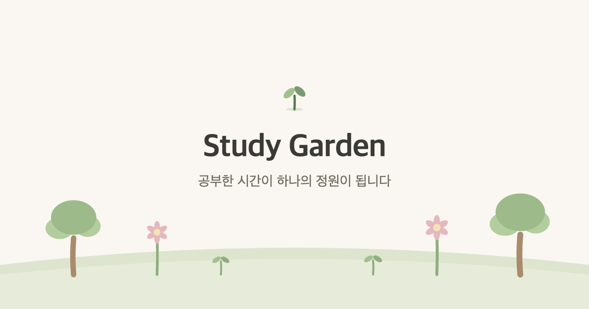
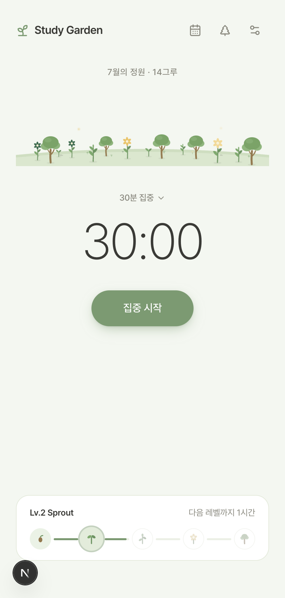
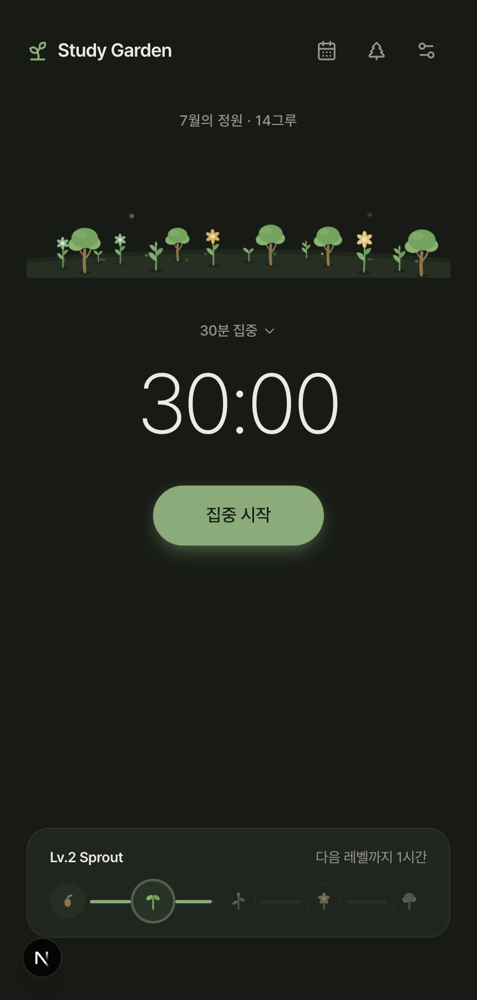
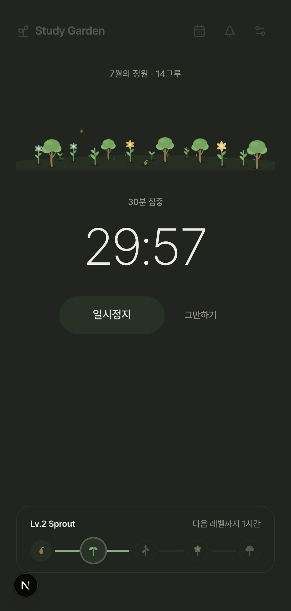
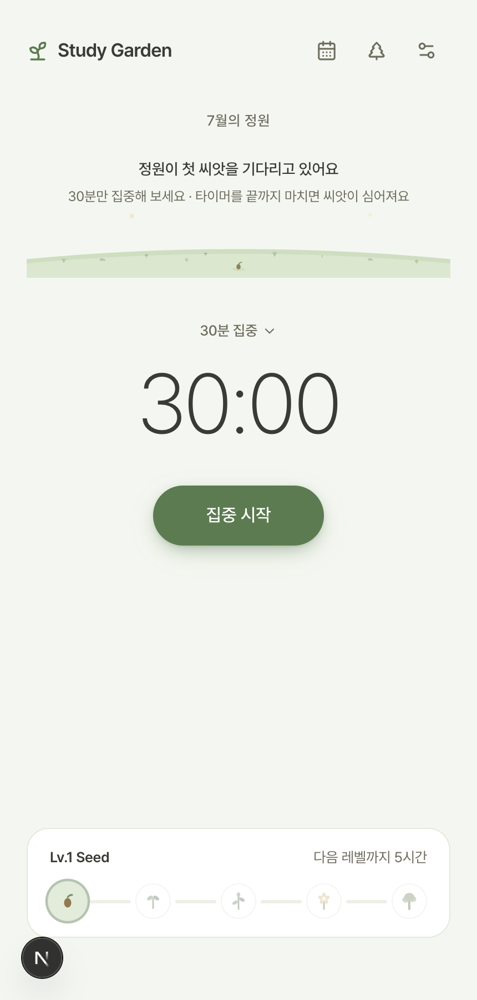
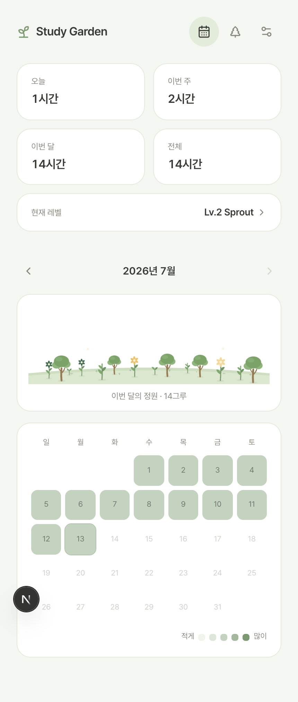
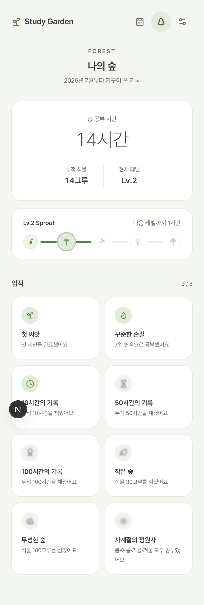

<p align="center">
  
</p>

<h1 align="center">Study Garden</h1>

<p align="center">공부한 시간이 하나의 정원이 됩니다.</p>

---

## 프로젝트 소개

Study Garden은 공부 타이머 앱입니다. 집중 세션을 끝까지 마치면 정원에 씨앗이 심어지고,
공부 시간이 쌓일수록 새싹 → 잎 → 꽃 → 나무로 자랍니다. 한 달의 공부가 하나의 정원이 되고,
정원들이 모여 나의 숲이 됩니다.

기능은 세 화면이 전부입니다 — **정원과 타이머**, **기록과 캘린더**, **숲과 업적**.
회원가입도, 서버도, 알림도 없습니다. 열면 바로 정원이 있고, 30분 뒤에 식물이 하나 늘어 있습니다.

## 문제 정의 — 왜 만들었는가

이 프로젝트는 두 가지 질문에서 시작했습니다.

**첫째, 공부 시간은 왜 소모처럼 느껴질까.**
타이머 앱의 시간은 흘러가면 사라집니다. 통계 화면의 막대그래프는 어제의 나를 숫자로만
남깁니다. 그런데 숫자는 애착의 대상이 되지 못합니다. 지난달에 42시간을 공부했다는 사실보다,
지난달의 정원에 나무가 세 그루 서 있다는 사실이 더 오래 기억에 남습니다. 시간을 **축적이
보이는 형태**로 바꾸면, 공부를 시작하는 마음의 비용이 낮아질 거라고 가정했습니다.

**둘째, 생산성 앱은 왜 차가울까.**
Forest는 나무를 심고, Finch는 새를 키우고, 동물의 숲은 섬을 가꿉니다. 이들의 공통점은
사용자가 앱을 "쓰는" 게 아니라 무언가를 "돌보러 온다"는 감각입니다. 반면 대부분의 공부
앱은 관리자의 얼굴을 하고 있습니다. 이 프로젝트의 목표는 그 사이 — **Apple의 정돈됨과
동물의 숲의 온기 사이**에 있는, 20대 대학생이 유치하다고 느끼지 않을 만큼의 귀여움이었습니다.

그래서 이 앱의 설계 원칙은 처음부터 하나였습니다:

> 사용자가 앱을 열었을 때 '공부 앱을 켰다'가 아니라 **'내 정원을 돌보러 왔다'**고 느끼게 할 것.

기능을 늘리는 대신 뺐고(백엔드 없음, 설정은 집중 시간과 정원의 계절 둘뿐), 개발 기간의 절반 이상을
기능이 아니라 여백·색·움직임·문장을 다듬는 데 썼습니다.

## 핵심 기능

- **집중 타이머** — 30/45/60/90분. 끝까지 마치면 씨앗이 심어지고, 중간에 포기하면 사라집니다.
  긴장감이 곧 게임 규칙입니다. 새로고침이나 브라우저 종료에도 진행 중인 세션은 복원됩니다.
- **살아있는 정원** — 식물은 심은 이후 누적 공부 시간으로 자랍니다(90분 → 잎, 270분 → 꽃,
  540분 → 나무). 모든 식물이 저마다 다른 주기로 바람에 흔들리고, 꽃머리는 줄기와 따로 미세하게
  움직입니다.
- **사계절** — 접속한 날짜의 계절이 팔레트를 결정합니다. 봄엔 벚꽃잎이 하나씩 떨어지고,
  여름밤엔 반딧불이 깜빡이고, 가을엔 낙엽이, 겨울엔 눈송이가 내립니다. 다크모드는 계절마다
  다른 톤의 밤이 됩니다. 원하면 설정에서 좋아하는 계절에 머무를 수도 있어요.
- **기록** — 월별 정원 아카이브와 잔디 캘린더. 지난달의 정원을 언제든 다시 볼 수 있습니다.
- **숲** — 평생 누적 공간. 총 공부 시간, 씨앗→나무 5단계 성장 여정으로 표현되는 레벨,
  8개의 업적(잠긴 업적은 안개 속에, 획득하면 꽃이 피듯 등장).

## 스크린샷

| 홈 — 정원과 타이머 | 다크모드 | 집중 중 |
|---|---|---|
|  |  |  |

| 첫 방문 | 기록 | 숲 |
|---|---|---|
|  |  |  |

## 기술 스택

Next.js 16 (App Router) · React 19 · TypeScript · Tailwind CSS v4 · framer-motion · zustand

백엔드 없음 — 모든 데이터는 localStorage에 저장됩니다. 정적 페이지 4장으로 빌드됩니다.

## 아키텍처

```
app/            페이지 3개 + template.tsx(페이지 전환) + globals.css(디자인 시스템 전체)
components/     garden/(SVG 정원·식물) · timer/ · records/ · ui/
stores/         zustand — sessions(기록) · timer(진행 상태) · ui
lib/            순수 함수 — 세션→식물 배치, 레벨, 통계, 계절, 업적
lib/storage/    localStorage repository
```

- **디자인 토큰이 유일한 진실.** 색·그림자·라운드는 전부 `globals.css`의 CSS 변수로 정의되고,
  Tailwind `@theme inline`을 거쳐 유틸리티가 됩니다. 컴포넌트에는 hex 코드가 없습니다.
  계절 4종 × 라이트/다크 = 8개 팔레트가 이 한 파일에 있습니다.
- **정원은 하나의 SVG 좌표계.** viewBox 800×250, 모든 식물은 뿌리가 (0,0)인 로컬 좌표로
  그려지고 지면 곡선 함수(`groundTopY`)를 따라 배치됩니다. 식물의 위치·품종은 세션 id의
  해시로 결정적으로 계산됩니다 — 같은 기록은 언제나 같은 정원을 그립니다.
- **애니메이션 이원화.** 수십 개가 동시에 도는 무한 루프(흔들림·계절 입자·글로우)는 CSS
  keyframes, 등장·스프링·전환은 framer-motion. `prefers-reduced-motion`에서는 장식 애니메이션이
  전부 꺼집니다.

## 구현 포인트

- **하이드레이션 안전한 계절 시스템** — 계절별 입자를 넷 다 DOM에 렌더하고 CSS
  `html[data-season=...]` 선택자로 하나만 표시합니다. JS 분기가 없으니 SSG와 클라이언트가
  다른 화면을 그릴 일이 없습니다.
- **세션 복원** — 진행 중 타이머는 종료 시각(epoch)으로 저장됩니다. 자리를 비운 사이 시간이
  다 지났다면, 복귀 시 완주로 인정하고 씨앗을 심은 뒤 완료 화면을 보여줍니다.
- **포기 확인 UI** — 경고 문구가 나타나도 버튼이 밀리지 않도록 자리를 항상 예약해 두는
  구조(레이아웃 시프트 실측 2px). 포기를 고민하는 순간이 이 앱에서 감정적으로 가장 중요한
  화면이라고 판단했습니다.
- **접근성** — 보조 텍스트 대비 4.9:1, primary 버튼 흰 글자 4.8:1(WCAG AA), 전역
  focus-visible 링, 44px 탭 타깃, safe-area 대응.

## 트러블슈팅

| 증상 | 원인과 해결 |
|---|---|
| 다크모드에서 특정 계절의 색이 샌다 | 다크 base 블록이 라이트 계절 블록보다 CSS에서 뒤에 오는 **캐스케이드 순서**로 동작하는 구조라, base가 모든 계절 변수를 덮어야 한다. 하나라도 빠지면 라이트 값이 누출 — 규칙을 CLAUDE.md에 문서화 |
| 겨울 눈송이가 라이트 모드에서 안 보임 | 눈 색이 배경과 4% 차이. "구현했다"와 "보인다"는 다르다 — 모든 시각 변경을 스크린샷으로 실측하는 루프를 만들고, 색을 계절 accent로 교체 |
| 포기 확인 시 버튼이 두 줄로 깨짐 | 버튼 라벨을 상태에 따라 갈아끼운 것이 원인. 라벨은 고정하고 경고는 자리가 예약된 별도 줄로 — 출시 심사에서 잡힌 P0 |
| 진행 중 세션이 새로고침에 증발 | 타이머 상태가 메모리에만 존재. 종료 시각을 영속화하고 부재 중 완료를 복귀 시 정산 |
| QA가 엉뚱한 결과를 냄 | :3000에 **다른 프로젝트의 dev 서버**가 떠 있었다. 측정 전에 `<title>`로 대상부터 검증하는 습관이 생김 |
| 수십 그루 흔들림이 무거움 | framer-motion 무한 루프 대신 CSS keyframes + 개체별 `--sway-a` 변수로 GPU에 위임 |

## 배운 점 — What I Learned

**1. 완성도는 기능이 아니라 상태의 개수다.**
화면 3개짜리 앱인데 검증해야 할 상태는 40개가 넘었습니다(3화면 × 라이트/다크 × 4계절 +
엠티/집중 중/일시정지/포기 확인/완료…). "기능 추가 금지"를 선언한 뒤에야 이 상태들이 보였고,
출시를 막은 결함은 전부 기능이 아니라 상태의 틈에서 나왔습니다. 다음 프로젝트에서는 상태
매트릭스를 먼저 그리고 시작할 겁니다.

**2. 디자인 토큰은 미학이 아니라 아키텍처다.**
색을 CSS 변수 한 층 뒤에 숨긴 결정 덕분에, 다크모드 전체 구축이 컴포넌트 수정 0건으로
끝났고, 접근성 대비 수정도 변수 두 개를 바꾸는 일이었습니다. 하드코딩된 색 하나가 나중에
지불하게 될 비용을 이 프로젝트 규모에서도 체감했습니다.

**3. "예쁘다"는 주장이고, 스크린샷은 증거다.**
빌드가 통과해도 눈송이는 안 보일 수 있고, 대비는 3.3:1일 수 있고, 버튼은 두 줄로 깨질 수
있습니다. 이 프로젝트에서 가장 값진 산출물은 코드가 아니라 **"모든 시각 변경은 실제 렌더링을
캡처해서 눈으로 확인한 뒤 완료라고 말한다"는 작업 규칙**과 그것을 자동화한 스크린샷
하네스였습니다. 접근성 대비처럼 눈으로도 안 되는 것은 수치로 쟀습니다.

**4. 감성은 큰 연출이 아니라 작은 규칙의 합이다.**
"살아있다"는 느낌은 화려한 애니메이션이 아니라 — 나무는 새싹보다 느리게 흔들린다,
벚꽃잎은 5.5초에 한 장이다, 경고 문구는 나타나도 아무것도 밀지 않는다, 빈 정원은 "비어
있다"가 아니라 "기다린다"고 말한다 — 같은 작은 결정들이 쌓여서 만들어졌습니다. 그리고
그 규칙들은 문서로 남겨야만 다음 작업에서도 지켜집니다.

**5. 마감의 기준은 남이 정해줘야 한다.**
스스로는 "거의 다 됐다"고 느낄 때 Apple 심사관의 눈으로 다시 보니 P0가 4개 나왔습니다.
출시 기준을 외부 시선(심사 체크리스트)으로 명문화하는 것이, 완성도를 감이 아니라 공정으로
만드는 방법이었습니다.

## 향후 계획

V1은 여기서 종료하고 유지보수 모드로 전환합니다. 다음을 V2 후보로 기록해 둡니다.

- Vercel 배포 및 도메인 연결
- PWA (manifest, 홈 화면 설치) — 모바일 상시 사용을 위해
- 시트 접근성 마무리 (Escape 닫기, 포커스 트랩)
- 정원 공유 — 한 달의 정원을 이미지로 내보내기
- 통계 심화 (주간 리듬, 시간대 분포)
- 서비스명·브랜딩 재검토

---

<p align="center"><sub>정원은 하루아침에 자라지 않습니다. 오늘 30분부터.</sub></p>
